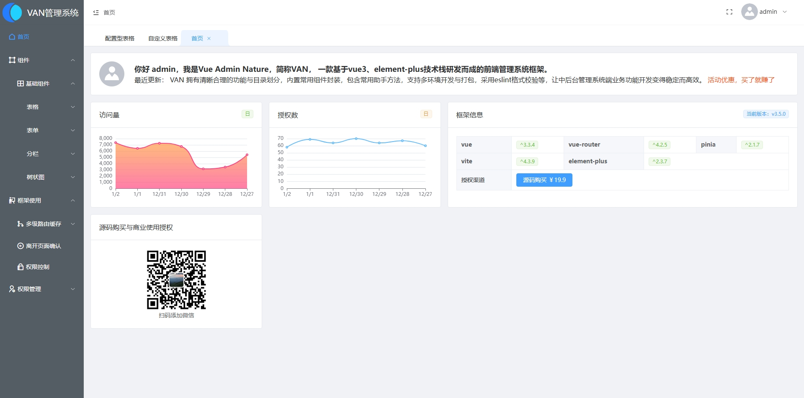
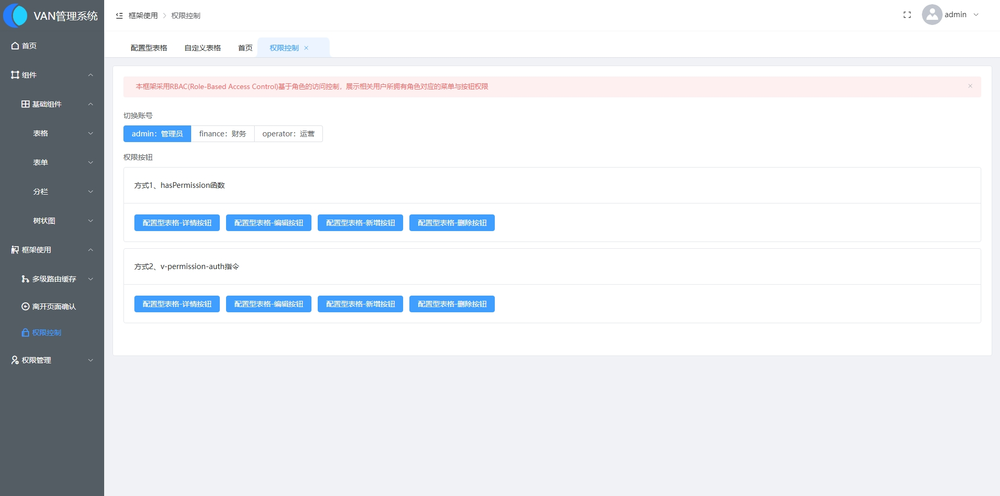
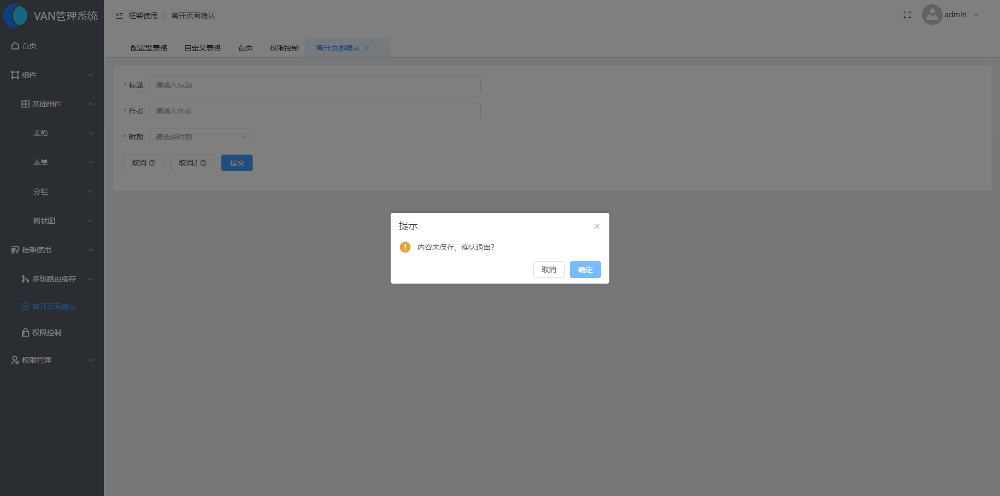
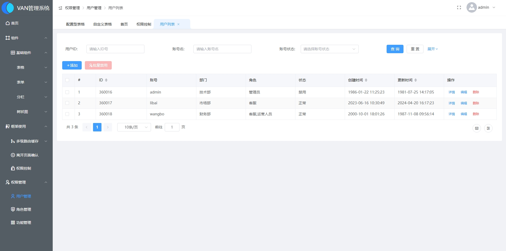
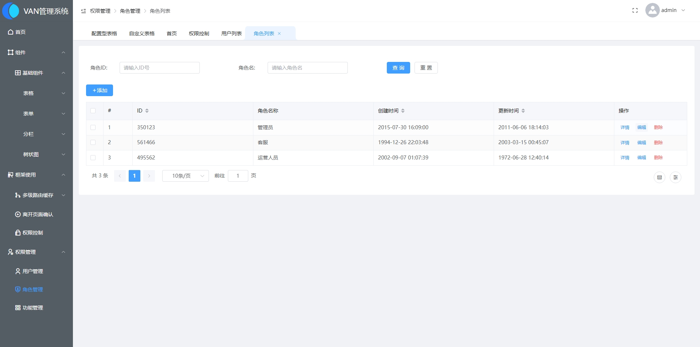
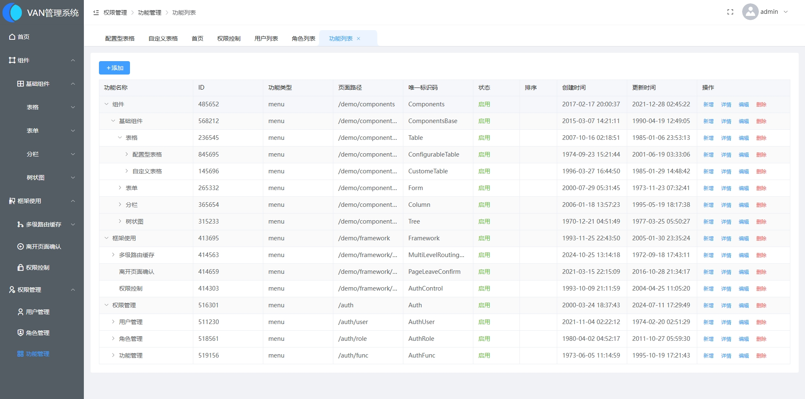
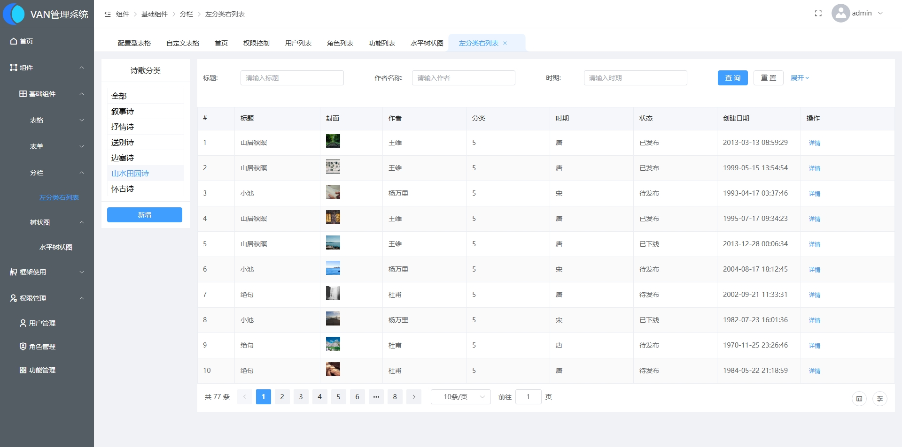
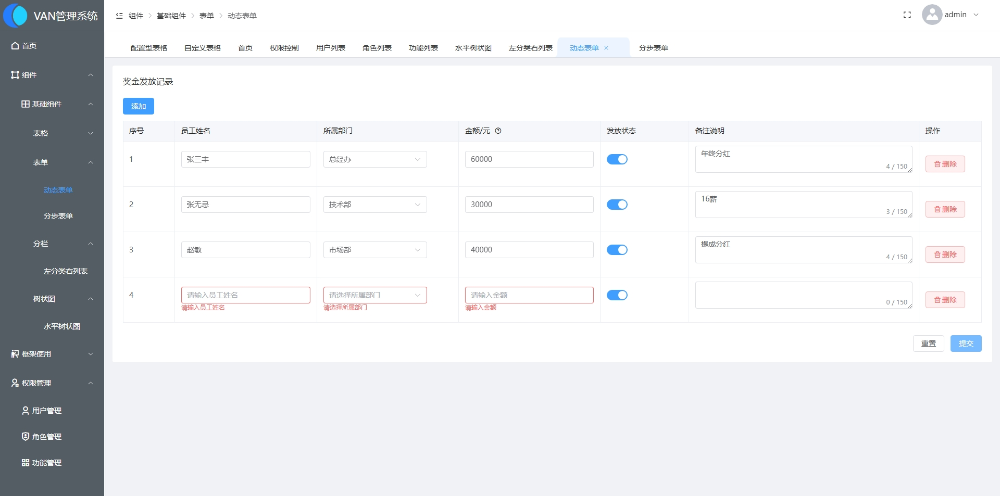

# VAN **管理系统框架** v3.5.0

#### **Vue Admin Nature，简称VAN， 一款基于vue3、element-plus技术栈研发而成的前端管理系统框架。**


## 主要特点

* VAN 管理系统框架采用最新技术栈研发而成
* 涵盖权限管理模块、权限菜单、权限按钮指令、多款内置通用组件（NTColumn、NTCustomTable、NTEcharts、NTSearchFormFilter等等）、合理的模块划分与功能封装（hooks、utils、settings、api）、支持mock开发、灵活的多环境配置与开发、打包模式支持、eslint支持团队开发代码格式有保障。
* 使用vue3、element plus最新前端技术栈
* 合理的目录、功能划分，便于二次开发
* 录制有使用案例视频，上手学习成本低
* 长期迭代升级维护，使用有保障
* 目前价格￥19.9即可商授权使用，超实惠！！！
* 支持有偿深度定制与学习疑问解答


## 面向对象

- 企 业：帮助企业快速实现项目搭建开发，极大节省基础性工作研发时间；
- 学习者：学习编程的同学可以用来进行学习交流；


## 技术选型

#### 前端框架

| 技术         | 名称                        | 官网                     |
| ------------ | --------------------------- | ------------------------ |
| vue3         | MVVM框架                    | https://cn.vuejs.org     |
| pinia        | 全局状态管理库              | https://pinia.vuejs.org/ |
| vite         | 构建现代 Web 应用的开发工具 | https://vite.dev/        |
| Element Plus | UI库                        | https://element-plus.org |


## 使用视频教程

https://www.bilibili.com/video/BV1L7U6YeE7N/?vd_source=bb56aa27fd727ed342a55bd4a3869b50


## 代码目录结构说明

```
目录结构，文件组织形式参照现有结构即可(尽可能按模块、把控好拆分颗粒度，拆分原则以便于扩展与管理为准)
```
```html
├── src                        # 源代码
│   ├── api                    # 所有api请求
│   │    │──modules            # api模块目录
│   │    │  └──auth.js         # 权限相关接口
│   │    │  └──goods.js        # 商品相关接口
│   │    └──index.js           # api主文件
│   ├── assets                 # 图片、svg 等静态资源
│   ├── components             # 公共组件
│   │    └──NTTable            # 表格组件
│   │    └──NTCustomTable      # 可调整风格、列表格组件
│   │    └──NTSearchFormFilter # 搜索表单过滤器组件
│   ├── settings               # 配置
│   │    └──config             # 常量配置
│   │    └──dict               # 用于后端不支持数据字典接口获取时，前端定义保有的数据字典定义目录
│   ├── directives             # 指令（按钮权限控制、input输入框输入内容、长度限制等）
│   ├── hooks                  # 钩子（代码逻辑复用）
│   ├── layouts                # 框架布局
│   ├── plugins                # 插件
│   ├── views                  # 页面
│   │    └──auth               # 权限管理
│   │         └──account       # 账号管理
│   │              └──list     # 账号列表
│   │              │     └──index.vue # 账号列表实际页面单文件.vue
│   │              └──edit     # 账号编辑
│   │                   └──index.vue # 账号编辑实际页面单文件.vue
│   ├── router                       # 路由配置
│   │    └──guards                   # 路由钩子
│   │    └──routes                   # 页面路由
│   │         └──index.js            # 路由主文件
│   │         └──basic.js            # 基础路由
│   │         └──permission          # 权限菜单路由
│   ├── store                        # pinia 状态管理
│   ├── utils                        # 工具库、方法
│   │    └──cache                    # 缓存操作
│   │    └──helper                   # 助手函数
│   │    └──http                     # http网络请求
│   │    └──other                    # 其它为归类
│   ├── styles            # 样式管理
│   ├── main.js           # 入口文件 加载组件 初始化等
│   └── App.vue           # 入口页面
├── .env                  # 通用环境变量配置
├── .env.development      # 开发环境下环境变量配置
├── .env.test             # 测试环境下环境变量配置
├── .env.uat              # UAT环境下环境变量配置
├── README                 # 说明文档
├── package.json           # package.json
├── package-lock           # package-lock.json
├── README                 # 说明文档
└── vite.config.js         # 项目运行编译配置
```


## 命名规范
+ 组件
  ```
  无论公共基础组件还是各级别、各类业务组件，命名尽量采用：文件夹（文件夹名为组件名）/index.vue
  ```
  例如：</br>
  公共组件NTTable: `/src/components/NTTable/index.vue`  </br>
  页面中业务组件BAR: `/src/views/goods/list/components/BAR/index.vue`  </br>
  结合实际情况，也可以这样命名：`/src/views/goods/list/components/BAR.vue`  </br>

+ 文件夹、页面、js、css文件等一律采用小驼峰命名方式：</br>
  1、`/src/hooks/usePermission.js`</br>
+ js变量命名、函数一律采用小驼峰命名方式</br>
``` javascript
    // 变量
    let googsList = ref([])

    // 函数
    const handleClick = () => {}

    function handleClick() {}
```

+ js常量命名采用全大写加下划线_分隔多个单词形式</br>
``` javascript
    // 常量
    const GOODS_STATUS = {
        0: '下架',
        1: '上架',
    }
```


## 已内置常用库

```
使用原则，优先使用已有工具库和方法，没有适合自身开发业务需求的，可以按照规范自行添加新工具库或方法
```
| js工具库                        | vue3工具库                    | css工具库                                             | icon图表                                                |
| ------------------------------- | ----------------------------- | ----------------------------------------------------- | ------------------------------------------------------- |
| [lodash](https://lodash.com/)   | [vueuse](https://vueuse.org/) | [tailwind](https://tailwindcss.com/docs/installation) | [element plus自带icon](https://element-plus.org/zh-CN/) |
| [moment](https://momentjs.com/) |                               |                                                       | [remixicon](https://www.remixicon.cn/)                  |


## 开发环境

建议开发者使用以下环境，避免带来运行失败问题

- Windows、Linux
- vscode
- nodejs v18左右


### 命令使用

```
输入命令后，根据命令行具体提示，进行选择即可
```
+ 本地开发 `npm run dev`
+ 打包项目 `npm run build`


## 合作与技术支持联系
- 联系邮箱： 1465768310@qq.com
- 工作微信： 

添加微信请备注来意，谨防忽略陌生人


## 捐赠打赏

感谢各位的支持，如果本项目对您在工作开发、学习中带来帮助，感谢打赏本项目，让我们有精力持续更加完善项目。您的支持，是我们一直坚持下来的动力。

<div style="overflow:hidden">
  
    
</div>


## 使用说明

- VAN可供且仅限免费学习使用
- 如需在商业项目中使用，请与我们联系进行商业授权后使用，否则将追究侵权等法律责任
- 不可将本项目用于任何违法等侵害国家利益的用途，否则将没收且追究相关法律责任


## VAN管理系统截图















